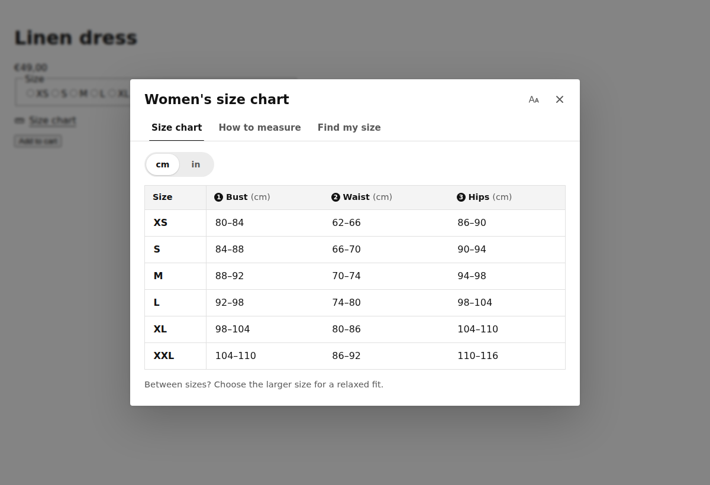

# Sizemate: size charts and Fit Finder for Shopify

Sizemate is a Shopify app built by SUN | WORKS. Merchants create size charts, choose which products show them, and shoppers get a size chart button on the product page with a cm/inch switch, a "How to measure" guide and a Fit Finder that recommends a size.

Turkish setup guide (Partner account, dev store, plans, launch): [docs/KURULUM.md](docs/KURULUM.md)



## What's in the box

| Area | What it does |
| --- | --- |
| Admin (`app/`) | Embedded app on React Router + Polaris web components: Home with setup guide, Size charts list, chart editor with live preview, Appearance, Plans |
| Storefront (`extensions/sizemate-theme/`) | Theme app extension: an app embed (automatic placement) and an app block (exact placement). No theme code edits |
| Data | Charts live in the app database (Prisma). A compact copy is published to app-data metafields, so the storefront never calls the app server |
| Billing | Shopify managed pricing: Free, Pro and Plus, with a 7-day trial. Limits are enforced on the server |

### Plans

| | Free | Pro ($4.99/mo) | Plus ($9.99/mo) |
| --- | --- | --- | --- |
| Size charts | 1 | Unlimited | Unlimited |
| Templates, cm/inch, measuring guide, 8 languages | ✓ | ✓ | ✓ |
| Colours, icon, drawer layout | | ✓ | ✓ |
| CSV import/export | | ✓ | ✓ |
| No "Powered by Sizemate" | | ✓ | ✓ |
| Fit Finder | | | ✓ |
| Chart translations | | | ✓ |

Plans are defined in `app/lib/plans.ts`. The names there must match the plan names in the Partner Dashboard.

## How a product gets its chart

The most specific chart wins: one that lists the product, then one that matches its collection, type, vendor or tag, then one for all products. Ties go to the chart higher in the merchant's list. The rule lives in `app/lib/rules.ts` and is mirrored in Liquid in `snippets/sizemate-core.liquid`; `tests/unit/liquid-parity.test.ts` renders the Liquid against 400 random shops and checks both agree.

## Development

Node 22.12+ and the [Shopify CLI](https://shopify.dev/docs/apps/tools/cli).

```bash
npm install
npm run config:link      # connect to your app in the Partner Dashboard (first time)
npm run dev              # shopify app dev: tunnel, dev store install, extension preview
```

| Command | What it runs |
| --- | --- |
| `npm test` | Unit, Liquid and integration tests (Vitest, 158 tests) |
| `npm run test:e2e` | Storefront in a real browser: placement, dialog, units, Fit Finder, mobile, axe accessibility (Playwright) |
| `npm run lint` / `npm run typecheck` | ESLint, TypeScript |
| `npm run build:storefront` | Rebuilds `extensions/sizemate-theme/assets/sizemate.js` from `app/storefront/sizemate.ts`. CI fails if it is stale |
| `npm run screenshots` | Refreshes `docs/screenshots` |
| `npm run deploy` | Deploys app config and the theme extension to Shopify |

Locally, point Playwright at a pre-installed Chromium with `PW_CHROMIUM_PATH=/path/to/chrome`.

## Layout

```
app/
  lib/            Pure logic shared by admin, server and storefront (chart model, units, rules, fit, plans, CSV, publish)
  models/         Server code: database, Admin API, publishing, billing, theme status
  components/     Admin UI pieces (table editor, assignment, preview, translations, setup guide)
  routes/         Admin pages and webhooks
  storefront/     Source of the storefront script (bundled into the extension's assets)
extensions/sizemate-theme/
  blocks/         size-chart (app block), sizemate-embed (app embed)
  snippets/       sizemate-core (matching + markup), sizemate-icon
  assets/         Built script, stylesheet (also used by the admin preview), diagrams
  locales/        en, de, fr, es, it, nl, pt-BR, tr
prisma/           Schema and migrations
tests/            unit, integration, e2e
```

## Privacy

Sizemate stores charts and settings per shop, and no customer data. The Fit Finder runs in the shopper's browser. `shop/redact` deletes all of a shop's data; the customer webhooks have nothing to return or delete.
