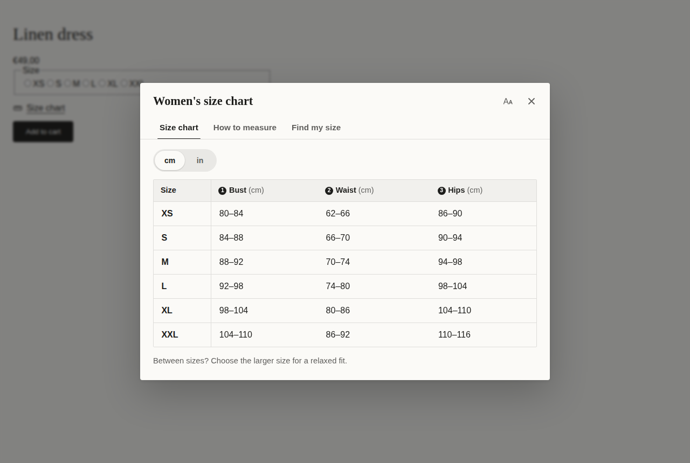
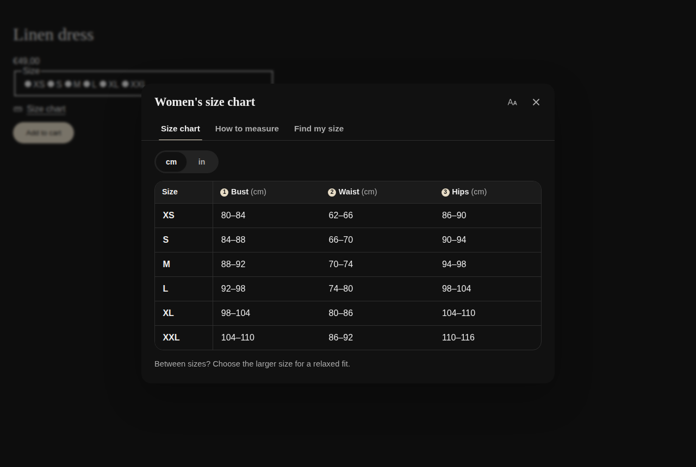
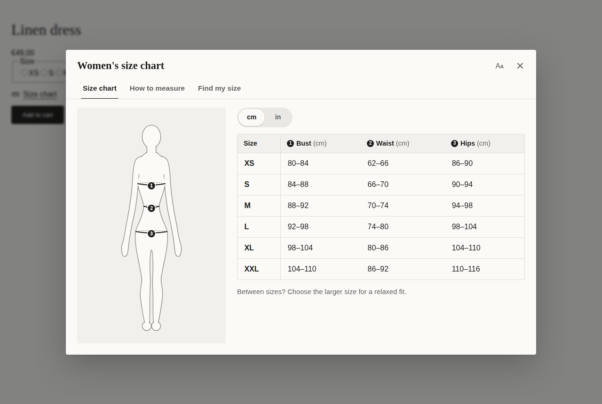
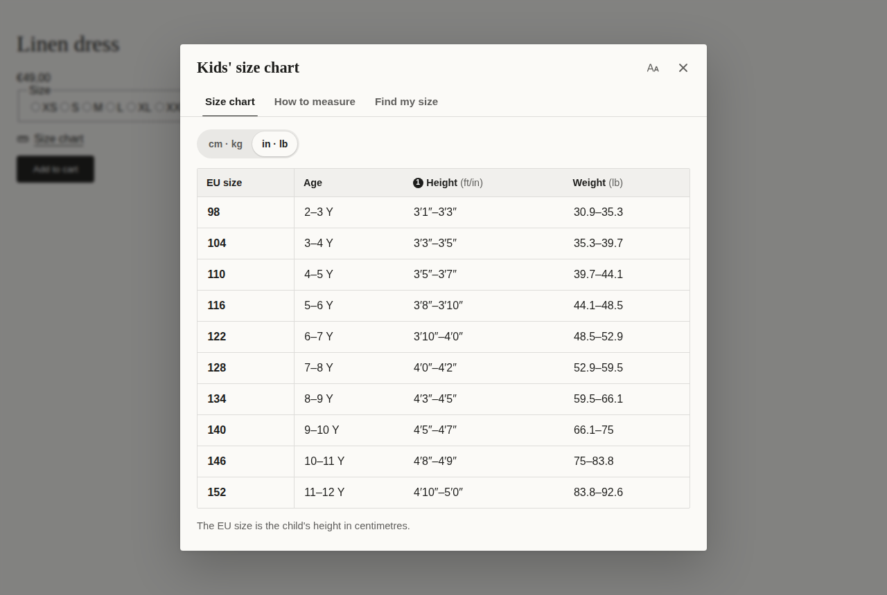

# Sizemate: size charts and Fit Finder for Shopify

Sizemate is a Shopify app built by SUN | WORKS. Merchants create size charts from 60 templates, choose which products show them, and shoppers get a size chart that matches the store's theme (fonts, colours, light or dark) with a metric/imperial switch, numbered measuring illustrations and a Fit Finder that recommends a size.

Turkish setup guide (Partner account, dev store, plans, launch): [docs/KURULUM.md](docs/KURULUM.md)



| Dark theme | Picture card | Imperial |
| --- | --- | --- |
|  |  |  |

## What's in the box

| Area | What it does |
| --- | --- |
| Admin (`app/`) | Embedded app on React Router + Polaris web components: Home with setup guide, Size charts, chart editor with undo/redo and a live preview, template gallery, Appearance (styles and design studio), Insights, Plans |
| Storefront (`extensions/sizemate-theme/`) | Theme app extension: an app embed (automatic placement) and an app block (exact placement). No theme code edits. A 2.5 KB page script; the runtime loads when a shopper reaches for the chart |
| Theme matching | `app/storefront/theme.ts` reads the theme's fonts, colours, button colour and corners in the browser; `sizemate.css` layers merchant choices, light/dark mode and the theme as CSS variables |
| Illustrations | `app/lib/figures.ts` is the single source of the measuring figures; the build generates `snippets/sizemate-figure.liquid` from it |
| Data | Charts live in the app database (Prisma). A compact copy is published to app-data metafields, so the storefront never needs the app server. Insights counts arrive through the app proxy |
| Billing | Shopify managed pricing: Free, Pro and Plus, with a 7-day trial. Limits are enforced on the server |

### Plans

| | Free | Pro ($4.99/mo) | Plus ($9.99/mo) |
| --- | --- | --- | --- |
| Size charts | 2 | Unlimited | Unlimited |
| Templates | 11 essentials | All 60 | All 60 |
| Theme matching, light/dark, accessibility, all units, illustrations, 8 languages | ✓ | ✓ | ✓ |
| Fit Finder (unlimited, every chart) | | ✓ | ✓ |
| Design studio: 7 styles, drawer, in-page and picture-card layouts, photo card, fit scale | | ✓ | ✓ |
| CSV import/export, no "Powered by Sizemate" | | ✓ | ✓ |
| Size memory (returning shoppers see their size), Insights, chart translations | | | ✓ |

New installs get every Plus feature for 14 days ("welcome", no card), then choose. A cancelled or downgraded plan stays on until the end of the period the merchant paid for. The rules live in `app/lib/access.ts`; an hourly job (`app/models/reconcile.server.ts`) ends periods on time even when nobody opens the app. `tests/integration/plans.test.ts` plays every timeline (welcome, upgrade, cancel, downgrade, frozen payment, uninstall) through the real routes and checks what the storefront receives.

Plans are defined in `app/lib/plans.ts`. The names there must match the plan names in the Partner Dashboard.

## How a product gets its chart

The most specific chart wins: one that lists the product, then one that matches its collection, type, vendor or tag, then one for all products. Ties go to the chart higher in the merchant's list. The rule lives in `app/lib/rules.ts` and is mirrored in Liquid in `snippets/sizemate-core.liquid`; `tests/unit/liquid-parity.test.ts` renders the Liquid against 400 random shops and checks both agree.

## Development

Node 22.12+ and the [Shopify CLI](https://shopify.dev/docs/apps/tools/cli).

```bash
npm install
npm run config:link      # connect to your app in the Partner Dashboard (first time)
npm run dev              # shopify app dev: tunnel, dev store install, extension preview
```

| Command | What it runs |
| --- | --- |
| `npm test` | Unit, Liquid, admin component and integration tests (Vitest, 359 tests) |
| `npm run test:e2e` | Storefront in a real browser: placement, theme matching, dark mode, layouts, units, Fit Finder, lazy loading, mobile, axe accessibility (Playwright, 31 tests) |
| `npm run lint` / `npm run typecheck` | ESLint, TypeScript |
| `npm run build:storefront` | Rebuilds the extension's scripts, stylesheet and figure snippet from `app/`. CI fails if they are stale |
| `npm run screenshots` | Refreshes `docs/screenshots` |
| `npm run deploy` | Deploys app config and the theme extension to Shopify |

Locally, point Playwright at a pre-installed Chromium with `PW_CHROMIUM_PATH=/path/to/chrome`.

## Layout

```
app/
  lib/            Pure logic shared by admin, server and storefront (chart model, units, rules, fit, plans, CSV, publish)
  models/         Server code: database, Admin API, publishing, billing, theme status
  components/     Admin UI pieces (table editor, assignment, preview, translations, setup guide)
  routes/         Admin pages and webhooks
  storefront/     Storefront source: page script, runtime, theme reader, stylesheet (built into the extension)
extensions/sizemate-theme/
  blocks/         size-chart (app block), sizemate-embed (app embed)
  snippets/       sizemate-core (matching + markup), guide, fit, fitscale, icon, figure (generated)
  assets/         Built scripts and stylesheet (the admin preview renders the same Liquid and CSS)
  locales/        en, de, fr, es, it, nl, pt-BR, tr
prisma/           Schema and migrations
tests/            unit, integration, e2e
```

## Privacy

Sizemate stores charts and settings per shop, and no customer data. The Fit Finder runs in the shopper's browser. Insights (Plus) keeps anonymous daily counts per chart: views, recommended sizes, results outside the chart. `shop/redact` deletes all of a shop's data; the customer webhooks have nothing to return or delete.
